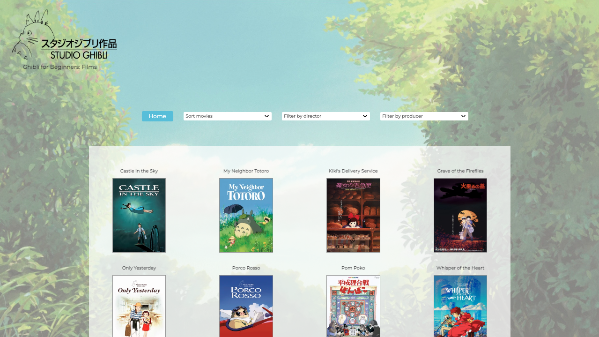
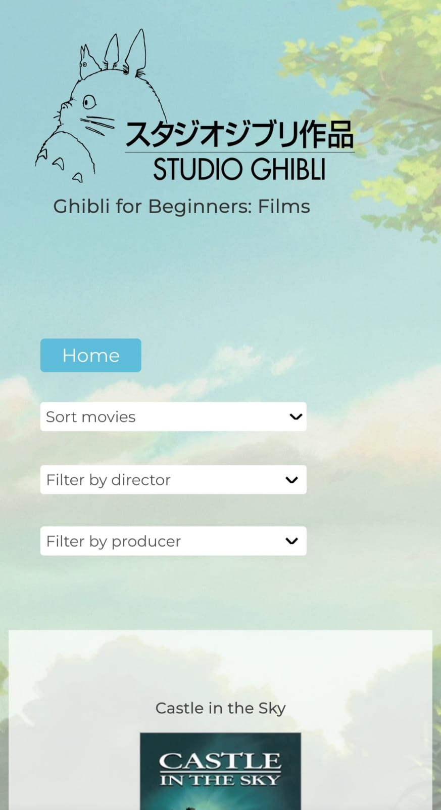
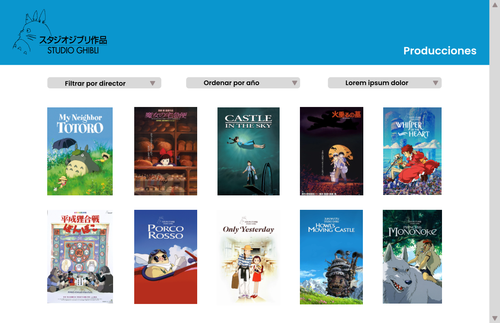
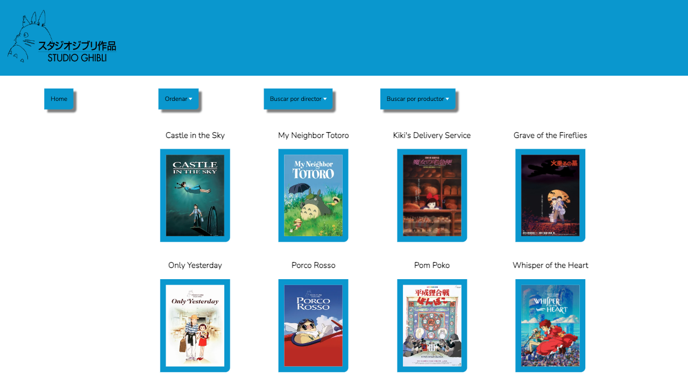
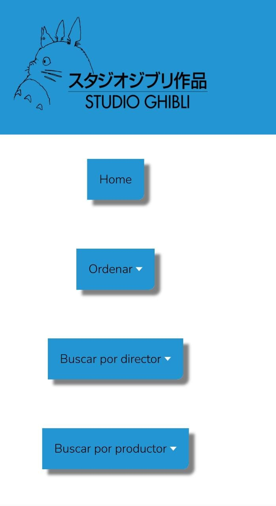
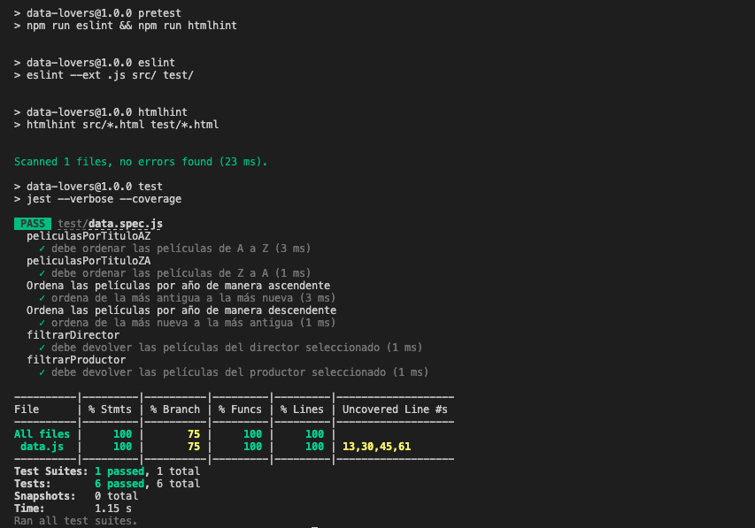

**Data Lovers - Studio Ghibli**

_Ghibli for Beginners_ ofrece información básica acerca de las producciones de Studio Ghibli; es útil como primera aproximación para personas que no conocen sus películas o que han visto sólo algunas y desean saber qué otras existen, así como datos (año de estreno, director o productor) que son punto de partida para indagaciones más amplias. Permite al usuario ordenar y filtrar información de películas (manipulación y renderizado de datos en tiempo real) en una misma página a través de menús desplegables. Su diseño es responsivo, por lo que funciona bien tanto en una computadora como en una tableta o un teléfono celular.

(version-actual-telefono-2.jpeg)

## Prototipo

Realizamos un prototipo que sirvió de guía conforme desarrollábamos la página; en él basamos la mayor parte de la primera versión de la página. 

(primera-version-telefono-2.jpeg)

Para organizar la información que los usuarios desean encontrar dividimos sus requerimientos en historias de usuario (HU) o solicitudes breves que se traducen en las siguientes funcionalidades.

1. Visualizar las películas.
2. Ordenar las películas de la A a la Z y de la Z a la A.
3. Ordenar las películas por año de estreno en orden ascendente y descendente.
4. Filtrar las películas por director.
5. Filtrar las películas por productor. 

A continuación pueden leerse las HU completas con sus criterios de aceptación y definiciones de terminado.

## Historias de usuario:

- HU1.- Definición:

_Yo, como aficionado a las producciones de Studio Ghibli, quiero saber cuáles son todas las películas que ha realizado para identificar aquellas que ya vi y las que me falta ver._

<b>Criterios de aceptación:</b>

1. Banner (fondo azul y logo).
2. Portadas visibles en la misma página, alineadas y separadas con título arriba.
3. Portadas interactivas. Al pasar el cursor se desliza una capa (hover overlay) y se muestran el nombre del director y el año de estreno de la película.
4. Diseño responsivo.

<b>Definición de terminado:</b>

1. Que el diseño sea similar al prototipo de alta.
2. Que dos usuarios nos den feedback.
3. Que esté desplegado en GitHub.

- HU2.- Definición:

_Yo, como aficionado a las producciones de Studio Ghibli, quiero saber cuál fue la última película que estrenó para estar al tanto de sus novedades._

<b>Criterios de aceptación:</b>

1. Que al presionar en el botón “ordenar” se muestre el menú desplegable con las opciones ascendente y descendente.
2. Que al presionar el botón “orden ascendente” se ordenen las películas de la más antigua a la más nueva.
3. Que al presionar el botón “orden descendente” se ordenen las películas de la más nueva a la más antigua.
4. Diseño responsivo.

<b>Definición de terminado:</b>

1. Que el diseño sea similar al prototipo de alta.
2. Que el botón funcione de manera correcta.
3. Que el menú se despliegue de manera correcta.
4. Que las películas se reordenen correctamente, según la instrucción.
5. Que las funciones pasen los tests.
6. Que dos usuarios nos den feedback.
7. Que esté desplegado en GitHub.

- HU3.- Definición:

_Yo, como aficionado a las producciones de Studio Ghibli, quiero ver las películas en orden alfabético (a-z y z-a) para encontrar de manera más rápida la que estoy buscando._

<b>Criterios de aceptación:</b>

1. Botón “Ordenar”.
2. Que al presionar en el botón “ordenar” se muestre el menú desplegable con las opciones “Ascendente”, “Descendente”, “A-Z” y “Z-A”.
3. Que al presionar el botón “A-Z” se ordenen las películas en orden alfabético.
4. Que al presionar el botón “Z-A” se ordenen las películas en orden alfabético inverso.
5. Diseño responsivo.

<b>Definición de terminado:</b>

1. Que el diseño sea similar al prototipo de alta.
2. Que el botón funcione de manera correcta.
3. Que el menú se despliegue de manera correcta.
4. Que las películas se reordenen correctamente, según la instrucción.
5. Que las funciones pasen los tests.
6. Que dos usuarios nos den feedback.
7. Que esté desplegado en GitHub.

- HU4.- Definición:

_Yo, como aficionado a las producciones de Miyazaki, quiero saber qué películas de Studio Ghibli dirigió para comprender su visión._

Apariencia:
Los botones de las historias de usuario se mostrarán sobre las películas en fila. Es este caso, al dar click sobre el botón “Buscar por director” se desplegará un menú que contenga los nombres de los seis directores.

<b>Criterios de aceptación (cosas que va a ver mi usuario):</b>

Botón “Buscar por director”.

Que al presionar en el botón “Buscar por director” se muestre el menú desplegable con los nombres de los seis directores.

Que al presionar el nombre de un director aparezcan sólo las películas que él dirigió.

Diseño responsivo.

<b>Definición de terminado:</b>

1. Que el diseño sea similar al prototipo de alta.
2. Que el botón funcione de manera correcta.
3. Que el menú se despliegue de manera correcta.
4. Que las películas se reordenen correctamente, según la instrucción.
5. Que las funciones pasen los tests.
6. Que dos usuarios nos den feedback.
7. Que esté desplegado en GitHub.

- HU5.- Definición:

_Yo, como aficionado a las producciones de Studio Ghibli, quiero saber qué productores han participado para conocer al equipo que ha realizado mis películas favoritas._

Apariencia:
Los botones de las historias de usuario se mostrarán sobre las películas en fila. Es este caso, al dar click sobre el botón “Buscar por productor” se desplegará un menú que contenga los nombres de los productores.

<b>Criterios de aceptación:</b>

1. Botón “Buscar por productor”.
2. Que al presionar en el botón “Buscar por productor” se muestre el menú desplegable con los nombres de los productores.
3. Que al presionar el nombre de un productor aparezcan sólo las películas que él dirigió.
4. Diseño responsivo.

<b>Definición de terminado:</b>

1. Que el diseño sea similar al prototipo de alta.
2. Que el botón funcione de manera correcta.
3. Que el menú se despliegue de manera correcta.
4. Que las películas se reordenen correctamente, según la instrucción.
5. Que las funciones pasen los tests.
6. Que dos usuarios nos den feedback.
7. Que esté desplegado en GitHub.

## Tests:

Para combrobar que las funciones más relevantes (ordenar y filtrar la data) se comportan según lo previsto, realizamos pruebas unitarias (tests) que evalúan su desempeño y nos permiten garantizar que no haya errores en su funcionamiento. También nos dejan saber qué porcentaje del código ha sido ejecutado por ellas.

Como se aprecia en la imagen, las seis funciones pasaron las pruebas. Además éstas tienen una cobertura del 100% para sentencias (_statements_), 75% para ramas (_branch_), 100% para funciones (_functions_), y 100% para líneas (_lines_) en el archivo src/data.js.

